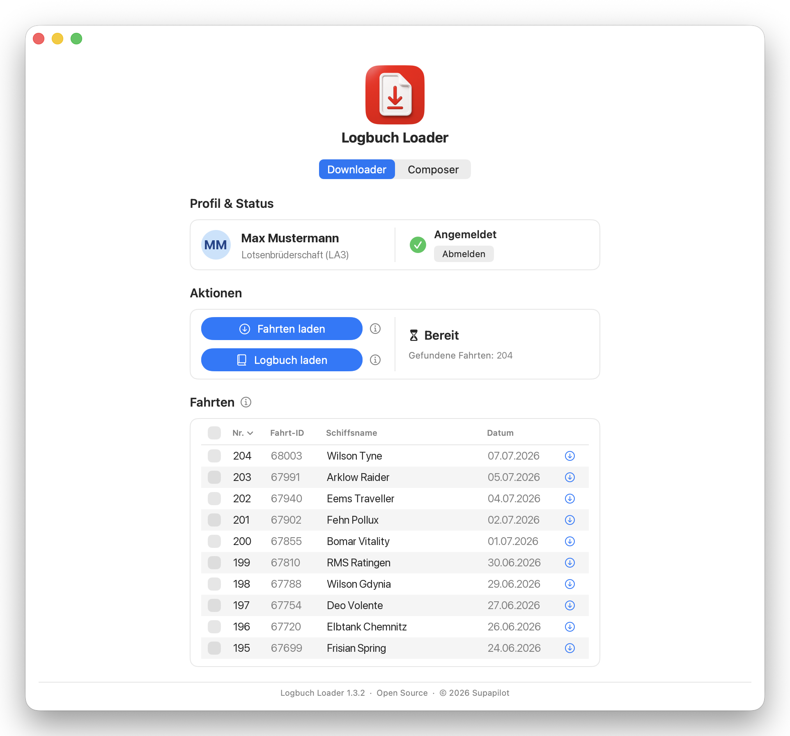
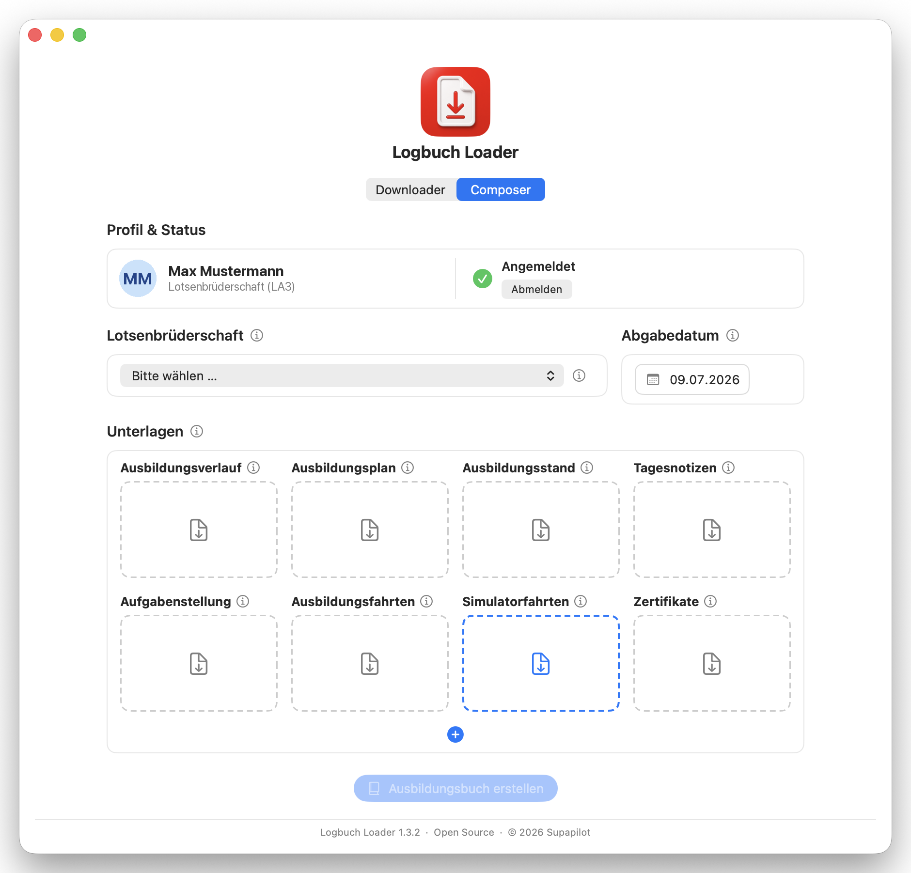

<p align="center">
  
</p>

<h1 align="center">Logbuch Loader</h1>

<p align="center">
  <a href="https://github.com/supapilot/logbuch-loader/actions/workflows/ci.yml"></a>
  <a href="https://github.com/supapilot/logbuch-loader/releases/latest"></a>
  
  <a href="LICENSE"></a>
</p>

Eine native macOS-App (SwiftUI) für **deutsche Seelotsenanwärter** in der
Seelotsenausbildung. Sie vereinfacht das Herunterladen und Zusammenstellen der
Ausbildungsunterlagen aus dem [BLK Logbuch](https://logbuch.lotsen.de/) und
unterstützt die Anwärter beim Anfertigen des nach § 7 Abs. 1 SeeLAufV
geforderten **Ausbildungsbuchs**. Sie meldet sich mit den vom Nutzer
eingegebenen Zugangsdaten an, lädt die einzelnen Fahrten-PDFs und fügt sie zu
einem vollständigen Ausbildungsbuch als PDF zusammen.

> **Hinweis:** Dies ist ein inoffizielles, privates Hilfswerkzeug und steht in
> keiner Verbindung zum Betreiber des BLK Logbuchs. Es nutzt lediglich die
> reguläre Anmeldung des Nutzers, um dessen **eigene** Unterlagen abzurufen.
> Nutzung auf eigene Verantwortung.

## Download

Die fertige, von Apple **notarisierte** App gibt es als DMG unter
[**Releases**](https://github.com/supapilot/logbuch-loader/releases/latest):
herunterladen, öffnen und in den Ordner **Programme** ziehen – ein
Rechtsklick → „Öffnen" ist nicht nötig. Voraussetzung: macOS 14 oder neuer.

## Funktionen

- **Anmeldung** mit Speicherung der Zugangsdaten im macOS-Schlüsselbund (Keychain).
- **Fahrten laden** – lädt alle Fahrten der aktuellen Stufe als PDF (paralleler
  Download).
- **Fahrten-Liste** – durchsuch- und sortierbare Liste aller Fahrten mit
  Einzel- und Mehrfach-Download.
- **Composer** – fügt hochgeladene PDFs/ZIPs zu einem einzigen, sauber
  gegliederten Ausbildungsbuch (Deckblatt, Inhaltsverzeichnis mit Sprungzielen,
  Kapitel) im A4-Format zusammen.
- **Automatische Update-Prüfung** ([Sparkle](https://sparkle-project.org)) –
  meldet neue Versionen und aktualisiert nach Bestätigung; der Nutzer behält die
  Kontrolle (kein stilles Auto-Update).

## Screenshots

<p align="center">
  
  <br><br>
  
</p>

> Die Screenshots zeigen anonymisierte Beispieldaten.

## Systemvoraussetzungen

- macOS 14.0 oder neuer
- Xcode 15+ (zum Bauen aus dem Quellcode)

## Bauen

Aus dem Quellcode – ohne Apple-Entwicklerkonto, mit lokaler Ad-hoc-Signatur:

```bash
xcodebuild -project "Logbuch Loader.xcodeproj" -scheme "Logbuch Loader" \
  -configuration Release CODE_SIGN_IDENTITY="-" CODE_SIGN_STYLE=Manual build
```

Oder das Projekt in Xcode öffnen und über **Product → Run** starten – dort bei
Bedarf unter *Signing & Capabilities* das eigene Team auswählen.

## Datenschutz & Sandbox

Die App läuft in der macOS App Sandbox mit einem minimalen Satz an Rechten:

- **Ausgehende Netzwerkverbindungen** – für Anmeldung, Download und die
  Update-Prüfung.
- **Zugriff auf vom Nutzer gewählte Ordner (Lesen/Schreiben)** – zum Speichern
  der PDFs im selbst gewählten Zielordner.
- **Sparkle-Installer** – eine dokumentierte
  [`mach-lookup`-Ausnahme](https://sparkle-project.org/documentation/sandboxing/),
  damit das Update aus der Sandbox heraus installiert werden kann.

Für [Little Snitch](https://www.obdev.at/products/littlesnitch/) liegt der App
eine **Internet Access Policy** bei, die alle Verbindungen samt Zweck erklärt.

Zugangsdaten werden ausschließlich lokal im Schlüsselbund gespeichert und nur an
das BLK Logbuch des Nutzers gesendet. Es werden keine Daten an Dritte
übertragen.

## Lizenz

Veröffentlicht unter der [Apache-Lizenz 2.0](LICENSE).

Die App wird mit [Sparkle](https://github.com/sparkle-project/Sparkle)
(MIT-Lizenz) für die automatische Update-Prüfung ausgeliefert. Der vollständige
Lizenztext aller mitgelieferten Drittanbieter-Komponenten steht in
[THIRD-PARTY-LICENSES.md](THIRD-PARTY-LICENSES.md).
