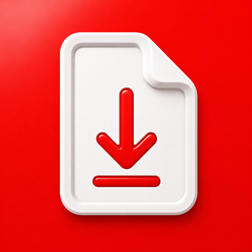

<p align="center">
  
</p>

<h1 align="center">Logbuch Loader</h1>

Eine native macOS-App (SwiftUI), die das Herunterladen und Zusammenstellen der
Ausbildungsunterlagen aus dem [BLK Logbuch](https://logbuch.lotsen.de/)
vereinfacht. Sie meldet sich mit den vom Nutzer eingegebenen Zugangsdaten an,
lädt die einzelnen Fahrten-PDFs und kann daraus ein vollständiges
**Ausbildungsbuch** als PDF erzeugen.

> **Hinweis:** Dies ist ein inoffizielles, privates Hilfswerkzeug und steht in
> keiner Verbindung zum Betreiber des BLK Logbuchs. Es nutzt lediglich die
> reguläre Anmeldung des Nutzers, um dessen **eigene** Unterlagen abzurufen.
> Nutzung auf eigene Verantwortung.

## Funktionen

- **Anmeldung** mit Speicherung der Zugangsdaten im macOS-Schlüsselbund (Keychain).
- **Fahrten laden** – lädt alle Fahrten der aktuellen Stufe als PDF (paralleler
  Download).
- **Fahrten-Liste** – durchsuch- und sortierbare Liste aller Fahrten mit
  Einzel- und Mehrfach-Download.
- **Composer** – fügt hochgeladene PDFs/ZIPs zu einem einzigen, sauber
  gegliederten Ausbildungsbuch (Deckblatt, Inhaltsverzeichnis mit Sprungzielen,
  Kapitel) im A4-Format zusammen.

## Systemvoraussetzungen

- macOS 14.0 oder neuer
- Xcode 15+ (zum Bauen aus dem Quellcode)

## Bauen

```bash
xcodebuild -project "Logbuch Loader.xcodeproj" \
  -scheme "Logbuch Loader" -configuration Release build
```

Oder das Projekt in Xcode öffnen und über **Product → Run** starten.

## Datenschutz & Sandbox

Die App läuft in der macOS App Sandbox mit einem minimalen Satz an Rechten:

- **Ausgehende Netzwerkverbindungen** – für Anmeldung und Download.
- **Zugriff auf vom Nutzer gewählte Ordner (Lesen/Schreiben)** – zum Speichern
  der PDFs im selbst gewählten Zielordner.

Zugangsdaten werden ausschließlich lokal im Schlüsselbund gespeichert und nur an
das BLK Logbuch des Nutzers gesendet. Es werden keine Daten an Dritte
übertragen.

## Lizenz

Veröffentlicht unter der [Apache-Lizenz 2.0](LICENSE).
